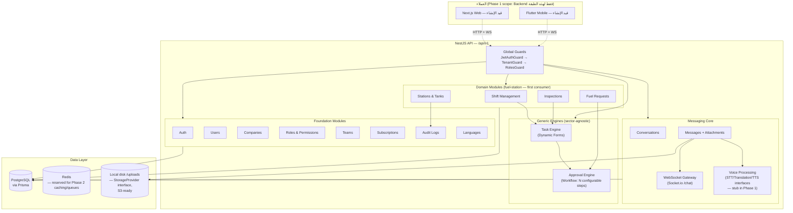
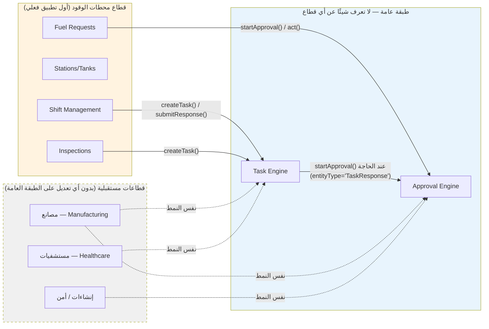
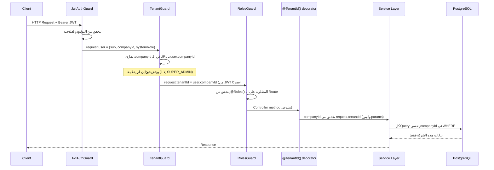

# WorkForce Connect AI — Architecture Diagram (نهاية المرحلة الأولى، Sprint 2)

## 1. نظرة عامة على الطبقات

## 2. مبدأ التصميم الأساسي: الفصل بين "المحرك" و"القطاع"

**القاعدة الصارمة المُطبَّقة فعليًا في الكود (وتم التحقق منها):**
لا يوجد أي Foreign Key من جداول `Task`/`TaskTemplate`/`Approval`/`ApprovalFlow` إلى `Station`/`Tank`/`FuelRequest`. الربط الوحيد هو:
- من جهة القطاع → المحرك: استدعاء دالة (`taskEngine.createTask()`, `approvalEngine.startApproval()`)
- من جهة المحرك → القطاع: حقل نصي حر `entityType` + `entityId` (polymorphic)، **وليس** علاقة قاعدة بيانات مباشرة

هذا يعني أن حذف وحدة `FuelRequestsModule` بالكامل لا يكسر Task Engine أو Approval Engine إطلاقًا.

## 3. طبقة الأمان (مُطبَّقة على كل طلب HTTP)

## 4. الوحدات المُنفَّذة حاليًا (خريطة كاملة)

| الطبقة | الوحدة | الحالة |
|---|---|---|
| Foundation | Auth (JWT + Refresh Rotation) | ✅ مكتمل + مُختبَر |
| Foundation | Companies (Multi-Tenant + Dashboard) | ✅ مكتمل |
| Foundation | Users | ✅ مكتمل + مُختبَر (tenant isolation) |
| Foundation | Roles & Permissions (RBAC مخصص لكل شركة) | ✅ مكتمل |
| Foundation | Teams | ✅ مكتمل |
| Foundation | Subscriptions | ✅ مكتمل |
| Foundation | Audit Logs | ✅ مكتمل |
| Foundation | Languages | ✅ مكتمل |
| Messaging | Conversations (Direct/Group/Team) | ✅ مكتمل |
| Messaging | Messages (نص/صوت/مرفقات/حالات) | ✅ مكتمل |
| Messaging | WebSocket Gateway | ✅ مكتمل |
| Messaging | Voice Processing (STT/Translation/TTS) | ✅ Interfaces جاهزة، Stub فقط (Phase 2 لاحقًا) |
| Engines | Task Engine (Dynamic Forms) | ✅ مكتمل + مُختبَر |
| Engines | Approval Engine (Workflow) | ✅ مكتمل + مُختبَر |
| Domain | Shift Management | ✅ مكتمل + مُختبَر |
| Domain | Stations & Tanks | ✅ مكتمل |
| Domain | Inspections | ✅ مكتمل |
| Domain | Fuel Requests | ✅ مكتمل + مُختبَر |

**إجمالي:** 18 Module، 46 اختبار وحدة ناجح، 0 أخطاء TypeScript، DI Container يُقلَع بالكامل.

## 5. ما تبقّى لإكمال المرحلة الأولى 100%
- Company Dashboard (تم بناء الـ API؛ الواجهة Next.js لم تُبنَ بعد)
- Worker Mobile App (Flutter) — لم يُبدأ بعد فعليًا (كان مخططًا في الجولة الأولى، أُجِّل لصالح تعميق الـ Backend حسب توجيهك)
- توثيق API الكامل (Swagger موجود وحي على `/api/docs`؛ يحتاج تصدير كملف ثابت للتوثيق)
- تعليمات Setup/Deployment الكاملة كملف منفصل
