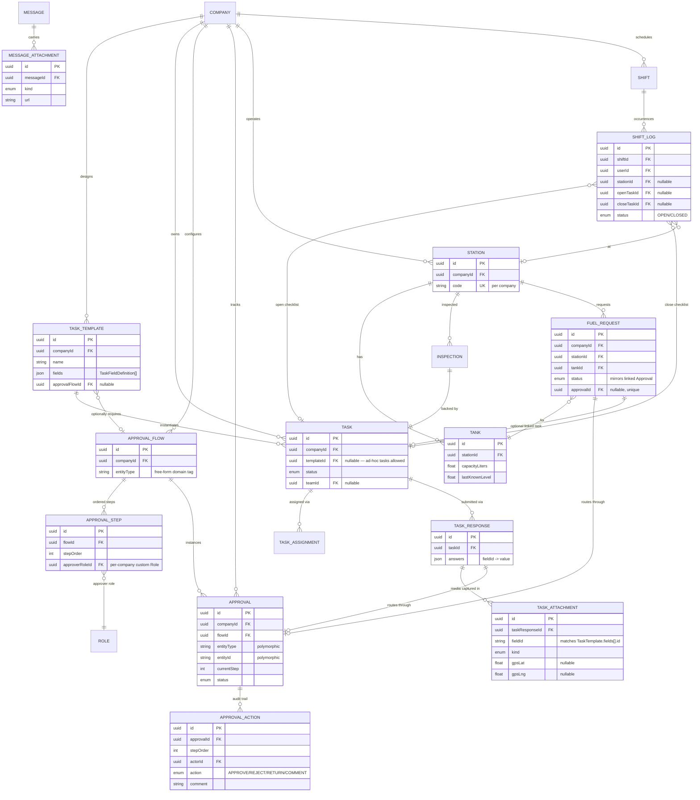

# WorkForce Connect AI — Database ERD (Phase 1)

## 1. Entity-Relationship Diagram

```mermaid
erDiagram
    COMPANY ||--o{ USER : "employs"
    COMPANY ||--o{ TEAM : "has"
    COMPANY ||--o{ CONVERSATION : "hosts"
    COMPANY ||--|| SUBSCRIPTION : "has one"
    COMPANY ||--o{ COMPANY_LANGUAGE : "supports"
    COMPANY ||--o{ AUDIT_LOG : "generates"
    COMPANY ||--o{ ROLE : "defines custom"

    LANGUAGE ||--o{ COMPANY_LANGUAGE : "enabled via"

    USER ||--o{ USER_ROLE : "assigned"
    ROLE ||--o{ USER_ROLE : "granted to"
    ROLE ||--o{ ROLE_PERMISSION : "has"
    PERMISSION ||--o{ ROLE_PERMISSION : "included in"

    USER ||--o{ TEAM_MEMBER : "joins"
    TEAM ||--o{ TEAM_MEMBER : "has"
    TEAM ||--o{ CONVERSATION : "owns team chat"

    USER ||--o| USER_PREFERENCE : "configures"
    USER ||--o{ REFRESH_TOKEN : "owns sessions"
    USER ||--o{ AUDIT_LOG : "acts as actor"

    CONVERSATION ||--o{ CONVERSATION_MEMBER : "includes"
    USER ||--o{ CONVERSATION_MEMBER : "participates in"

    CONVERSATION ||--o{ MESSAGE : "contains"
    USER ||--o{ MESSAGE : "sends"
    MESSAGE ||--o{ MESSAGE_TRANSLATION : "translated into"
    MESSAGE ||--o{ MESSAGE_RECEIPT : "tracked per recipient"
    USER ||--o{ MESSAGE_RECEIPT : "receipt owner"

    COMPANY {
        uuid id PK
        string name
        string slug UK
        string defaultLanguage
        boolean isActive
    }
    USER {
        uuid id PK
        uuid companyId FK "nullable, null = Super Admin"
        string email
        string passwordHash
        enum systemRole
        string preferredLanguage
        boolean isActive
    }
    ROLE {
        uuid id PK
        uuid companyId FK "nullable = system template"
        string name
    }
    PERMISSION {
        uuid id PK
        string code UK
    }
    TEAM {
        uuid id PK
        uuid companyId FK
        string name
    }
    CONVERSATION {
        uuid id PK
        uuid companyId FK
        enum type
        uuid teamId FK "nullable"
    }
    MESSAGE {
        uuid id PK
        uuid conversationId FK
        uuid senderId FK
        enum type
        enum status
        string originalText
        string originalLang
        string audioUrl
    }
    MESSAGE_TRANSLATION {
        uuid id PK
        uuid messageId FK
        string langCode
        string translatedText
    }
    LANGUAGE {
        string code PK
        string name
        boolean isRtl
    }
    SUBSCRIPTION {
        uuid id PK
        uuid companyId FK UK
        enum plan
        enum status
        int seatsLimit
    }
    AUDIT_LOG {
        uuid id PK
        uuid companyId FK "nullable"
        uuid actorId FK "nullable"
        enum action
        string entityType
    }
    REFRESH_TOKEN {
        uuid id PK
        uuid userId FK
        string tokenHash UK
        datetime expiresAt
        datetime revokedAt
    }
```

## 2. شرح العلاقات الأساسية

### Company (الجذر لعزل الـ Multi-Tenant)
كل جدول تقريبًا يرتبط بـ `Company` بشكل مباشر (`companyId`) أو غير مباشر (عبر `Conversation`/`Team`). هذا هو أساس العزل: أي استعلام لا يمرّ عبر `companyId` يُعتبر خطأ أمني.

- `User.companyId` **nullable** حصريًا لحالة `SUPER_ADMIN` (مستخدم على مستوى المنصة، لا ينتمي لأي شركة).
- `Role.companyId` **nullable** يفرّق بين الأدوار الأساسية للنظام (`isSystem = true`, `companyId = null`) والأدوار المخصصة التي تنشئها كل شركة.

### User ↔ Role ↔ Permission (RBAC مرن)
`User` يرتبط بعدة `Role` عبر جدول وسيط `UserRole`، وكل `Role` يرتبط بعدة `Permission` عبر `RolePermission`. هذا يسمح بصلاحيات دقيقة (`users.create`, `teams.manage`, ...) فوق طبقة `SystemRole` الخشنة (SUPER_ADMIN/COMPANY_ADMIN/TEAM_LEAD/WORKER) المستخدمة في الفحوصات السريعة على مستوى الـ Route.

### Team ↔ TeamMember ↔ User
علاقة Many-to-Many عبر `TeamMember`، مع حقل `isLead` لتمييز قائد الفريق دون الحاجة لدور نظام منفصل لكل حالة.

### Conversation ↔ ConversationMember ↔ User
نفس نمط الـ join table، يدعم محادثات ثنائية (`DIRECT`)، جماعية (`GROUP`)، أو مرتبطة بفريق (`TEAM`, عبر `teamId`).

### Message ↔ MessageTranslation ↔ MessageReceipt
- `Message` يخزّن **النص/الصوت الأصلي فقط** كما أرسله المستخدم (`originalText`/`audioUrl` + `originalLang`).
- `MessageTranslation` جدول **جاهز لكن فارغ في المرحلة الأولى** — سيُملأ في المرحلة الثانية بواسطة خدمة الترجمة، بمعدل صف واحد لكل لغة مطلوبة، مع تتبع أي محرك (`engine`) أنتجها.
- `MessageReceipt` يفصل حالة "أُرسلت/سُلّمت/قُرئت" (Sent/Delivered/Read) **لكل مستلم على حدة** — ضروري في المحادثات الجماعية حيث تختلف حالة القراءة بين الأعضاء؛ `Message.status` نفسه يُستخدم فقط كحالة مبسّطة للمحادثات الثنائية.

### Subscription (One-to-One مع Company)
علاقة `@unique` تضمن اشتراكًا واحدًا فعالًا لكل شركة، يديره Super Admin (`plan`, `status`, `seatsLimit`).

### AuditLog
`companyId` و `actorId` كلاهما **nullable** لتغطية أحداث على مستوى المنصة لا ترتبط بشركة معينة (مثال: Super Admin يعطّل شركة كاملة).

### RefreshToken
مرتبط بـ `User` فقط (ليس بالشركة مباشرة) لأن الجلسة خاصية للمستخدم نفسه؛ عزل الشركة يتم أصلاً عبر `User.companyId` عند التحقق من التوكن في `JwtStrategy`.

---

## 3. إضافات Sprint 2 — Task Engine + Approval Engine + الوحدات القطاعية



### شرح العلاقات الجديدة

**TaskTemplate → Task → TaskResponse → TaskAttachment (النماذج الديناميكية)**
`TaskTemplate.fields` هو مصفوفة JSON تصف الحقول (نوع، تسمية، إلزامي، خيارات) — لا حاجة لأي migration عند تصميم شركة لنموذج جديد. `TaskResponse.answers` يربط كل `fieldId` بالقيمة المُدخلة، بينما الحقول من نوع وسائط (صورة/فيديو/صوت/توقيع/GPS) تُخزَّن كسجل منفصل في `TaskAttachment` (وليس داخل JSON) للحفاظ على قابلية الاستعلام والفهرسة على الموقع الجغرافي مثلًا.

**ApprovalFlow → ApprovalStep → Approval → ApprovalAction (محرك سير العمل العام)**
هذا الهيكل **لا يعرف شيئًا عن القطاع** — `ApprovalStep.approverRoleId` يشير إلى جدول `Role` القابل للتخصيص لكل شركة (وليس Enum ثابت)، مما يجعل تسلسل "Worker → Supervisor → Manager" مجرد تكوين بيانات (Data)، قابل لأي شركة لتصميم تسلسل مختلف (خطوة واحدة، أو أربع خطوات). `Approval.entityType` + `entityId` علاقة polymorphic — لا يوجد أي Foreign Key من جداول المحرك إلى `FuelRequest` أو أي كيان قطاعي، وهذا ما يضمن إعادة الاستخدام الكاملة لقطاعات مستقبلية. `ApprovalAction` هو سجل التتبّع (Audit Trail) المطلوب صراحة — كل قرار (Approve/Reject/Return/Comment) يُسجَّل بشكل دائم مع مُنفِّذه ووقته وتعليقه.

**Shift / ShiftLog (على الطبقة العامة Task Engine)**
`ShiftLog` لا يحتوي على أي منطق نموذج خاص به — قوائم فتح/إغلاق الوردية هي `Task` عادية مبنية من `TaskTemplate`، و`ShiftLog` فقط يربط بداية/نهاية زمنية حقيقية بمعرّفَي المهمتين.

**Station / Tank / Inspection / FuelRequest (أول وحدة قطاعية فعلية — محطات الوقود)**
هذه الجداول هي المثال التطبيقي الوحيد الحالي لكيفية بناء قطاع فوق المحركين العامّين:
- `Inspection` مجرد جدول ربط بين `Station` و `Task` (لا منطق خاص).
- `FuelRequest` يحتوي على بيانات قطاعية حقيقية (كمية، خزان، مستوى) + `approvalId` اختياري يربطه بمثيل `Approval` عام. حالة `FuelRequest.status` (`PENDING_SUPERVISOR`/`PENDING_MANAGER`/...) هي **حالة مُشتقة معروضة (denormalized)** لأغراض الفلترة السريعة في الواجهة، ويُعاد حسابها من `Approval.status`/`currentStep` في كل مرة يُتخذ فيها قرار — وليست مصدر الحقيقة (source of truth)؛ المصدر الحقيقي دائمًا هو سجل `Approval`/`ApprovalAction`.

**MessageAttachment**
ملفات إضافية في المحادثة (صور، مستندات) بخلاف الرسائل الصوتية الأساسية التي تستخدم `Message.audioUrl` مباشرة.

